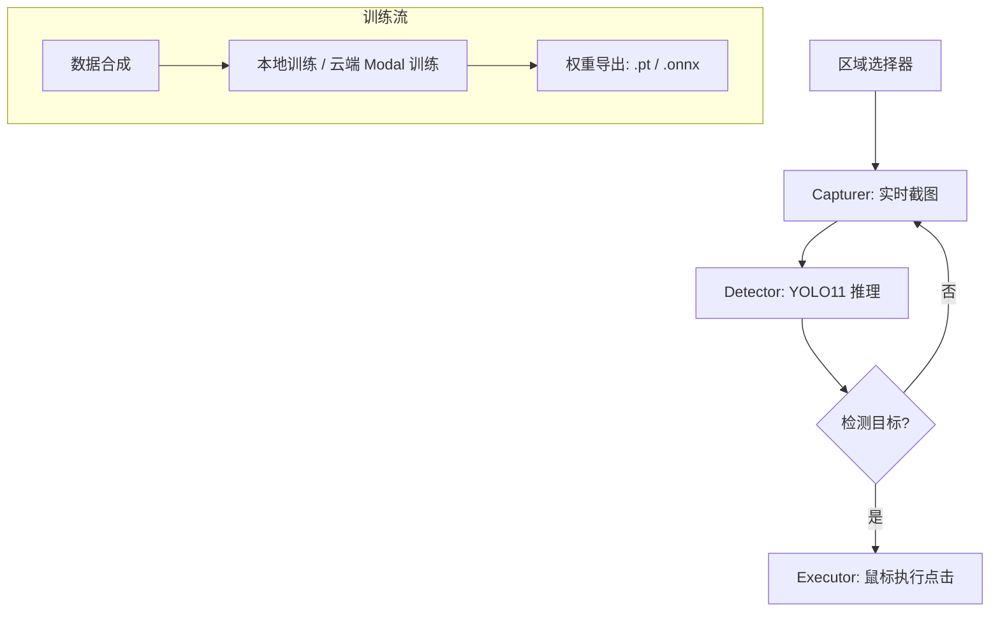

# VisionAuto-Monitor (YOLO11)

<div align="center">
  
  
  
  
</div>

VisionAuto-Monitor 是一个全自动视觉监控与操作工具。它允许用户选择特定的屏幕区域，使用 YOLO11 进行目标检测（例如：重试按钮），并在检测到目标时自动执行秒级相应的物理点击。

---

### 🚀 核心功能
- 🚀 **毫秒级响应**：结合高性能截图与 YOLO11 推理引擎。
- 🎯 **自定义监控**：灵活选择屏幕任意区域进行实时监听。
- ☁️ **云端/本地双模训练**：支持本地微调或一键同步至 Modal 云端 (GPU A10G) 训练。
- 🖱️ **自动化交互**：检测目标即刻触发点击，告别重复劳动。

---

## 🛠️ 技术架构



---

## 📦 安装指南

### 1. 克隆项目
```bash
git clone https://github.com/shenmadouyaowen/VisionAuto-Monitor.git
cd VisionAuto-Monitor
```

### 2. 环境搭建 (推荐使用虚拟环境)
```bash
# 创建虚拟环境
python -m venv venv

# 激活虚拟环境
# Windows:
venv\Scripts\activate
# Linux/macOS:
source venv/bin/activate

# 安装依赖项
pip install --upgrade pip
pip install -r requirements.txt
```

---

## 📖 使用步骤

### 第一步：模型准备
你可以直接使用项目内置的模型，或者自行训练：
- **方案 A (使用内置模型)**：直接跳转到第三步，项目已包含 `models/retry_model.onnx`。
- **方案 B (本地训练)**：
  1. 运行 `python scripts/data_synth.py` 合成数据集。
  2. 运行 `python scripts/train.py` 开始微调。
- **方案 C (Modal 云端训练)**：
  如果你有 Modal 账号，可以利用云端 GPU：
  ```bash
  modal setup
  python scripts/train_modal.py
  ```

### 第二步：权重管理 (可选)
如果需要手动下载官方权重或更新：
```bash
python scripts/download_weights.py
```

### 第三步：启动程序
```bash
python -m src.ui.dashboard
```

---

## 🛡️ 安全与维护
- ✅ **持续优化**：如需定制检测目标，请参考 `scripts/crop_icons.py` 进行图标采样。

## 📄 许可证
本项目采用 MIT 许可证，详情请参阅 [LICENSE](LICENSE) 文件。
